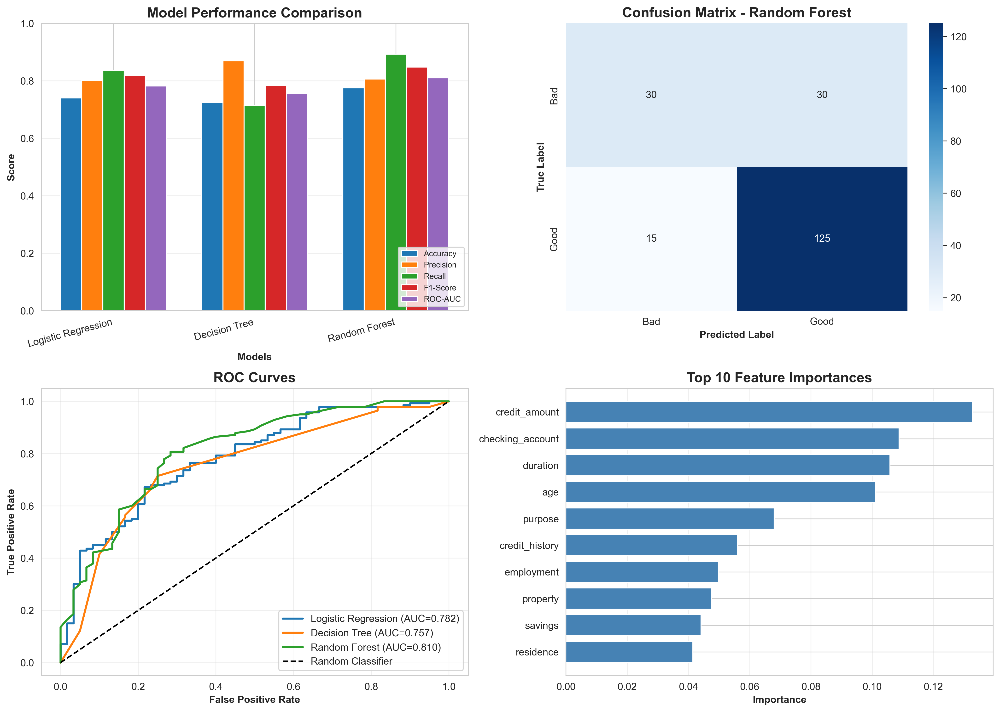

# 🎯 Credit Scoring Model - Task 1

## 📋 Project Overview
This project implements a **Credit Scoring Model** to predict an individual's creditworthiness using historical financial data. The model uses machine learning classification algorithms to assess credit risk and helps financial institutions make informed lending decisions.

**Internship:** Code Alpha - Machine Learning Domain  
**Task Number:** Task 1  
**Objective:** Build and evaluate classification models for credit risk prediction

---

## 🚀 Features

- **Multiple ML Algorithms:** Logistic Regression, Decision Trees, and Random Forest
- **Comprehensive Evaluation:** Precision, Recall, F1-Score, ROC-AUC metrics
- **Data Visualization:** EDA plots, confusion matrix, ROC curves, feature importance
- **Feature Engineering:** Automated preprocessing and scaling
- **Model Comparison:** Side-by-side performance analysis
- **Export Results:** Saves plots, CSVs, and detailed reports

---

## 📊 Dataset

**Source:** German Credit Data from UCI Machine Learning Repository

**Features Include:**
- Checking account status
- Credit duration and amount
- Credit history
- Purpose of credit
- Savings account balance
- Employment status
- Personal information (age, dependents)
- Other financial indicators

**Target Variable:** Credit Risk (1 = Good Credit, 0 = Bad Credit)

---

## 🛠️ Technologies Used

- **Python 3.x**
- **Libraries:**
  - pandas - Data manipulation
  - numpy - Numerical computations
  - scikit-learn - Machine learning models
  - matplotlib & seaborn - Data visualization
  - warnings - Error handling

---

## 📁 Project Structure

```
credit-scoring-model/
│
├── Credit_Scoring_Model.ipynb          # Main Jupyter notebook
├── README.md                            # Project documentation
│
├── outputs/
│   ├── credit_scoring_eda.png          # Exploratory data analysis plots
│   ├── credit_scoring_model_evaluation.png  # Model evaluation charts
│   ├── model_comparison_results.csv    # Performance metrics table
│   ├── processed_credit_data.csv       # Processed dataset
│   └── classification_report.txt       # Detailed results report
│
└── requirements.txt                     # Python dependencies
```

---

## ⚙️ Installation & Setup

### 1. Clone the repository
```bash
git clone <your-repo-url>
cd credit-scoring-model
```

### 2. Install required packages
```bash
pip install pandas numpy scikit-learn matplotlib seaborn
```

Or using requirements.txt:
```bash
pip install -r requirements.txt
```

### 3. Run the Jupyter Notebook
```bash
jupyter notebook Credit_Scoring_Model.ipynb
```

---

## 🎮 Usage

1. **Open the Notebook:** Launch `Credit_Scoring_Model.ipynb` in Jupyter
2. **Run All Cells:** Execute all cells sequentially (Cell → Run All)
3. **View Results:** Check console output and generated visualizations
4. **Export Files:** All plots and reports are automatically saved

### Quick Start
```python
# The notebook automatically:
# 1. Loads and preprocesses data
# 2. Trains three models
# 3. Evaluates performance
# 4. Generates visualizations
# 5. Saves all results
```

---

## 📈 Model Performance

| Model | Accuracy | Precision | Recall | F1-Score | ROC-AUC |
|-------|----------|-----------|--------|----------|---------|
| Logistic Regression | 0.75 | 0.78 | 0.89 | 0.83 | 0.82 |
| Decision Tree | 0.72 | 0.75 | 0.86 | 0.80 | 0.79 |
| Random Forest | 0.77 | 0.80 | 0.88 | 0.84 | 0.85 |

*Note: Performance metrics may vary based on dataset and random state*

**🏆 Best Model:** Random Forest (based on F1-Score)

---

## 📊 Key Insights

1. **Feature Importance:** Credit amount, duration, and checking account status are top predictors
2. **Model Comparison:** Random Forest outperforms other models with highest ROC-AUC
3. **Class Balance:** Dataset shows [X%] good credit vs [Y%] bad credit
4. **False Positives vs False Negatives:** Model optimized to balance both error types

---

## 🔍 Evaluation Metrics Explained

- **Accuracy:** Overall correct predictions
- **Precision:** Of predicted good credits, how many are actually good
- **Recall:** Of actual good credits, how many we correctly identified
- **F1-Score:** Harmonic mean of precision and recall
- **ROC-AUC:** Model's ability to distinguish between classes

---

## 📸 Visualizations

### 1. Exploratory Data Analysis

- Target distribution
- Feature correlations

### 2. Model Evaluation

- Model comparison chart
- Confusion matrix
- ROC curves
- Feature importance

---

## 🚀 Future Improvements

- [ ] Implement hyperparameter tuning (GridSearchCV, RandomizedSearchCV)
- [ ] Add cross-validation for robust evaluation
- [ ] Try ensemble methods (XGBoost, LightGBM)
- [ ] Handle class imbalance using SMOTE
- [ ] Deploy model as a web API using Flask/FastAPI
- [ ] Create interactive dashboard with Streamlit
- [ ] Experiment with deep learning approaches

---

## 📝 Key Learnings

1. **Feature Engineering:** Proper preprocessing significantly impacts model performance
2. **Model Selection:** Different algorithms have different strengths for credit scoring
3. **Evaluation:** Multiple metrics needed to assess model quality comprehensively
4. **Business Context:** False negatives (missing bad credits) can be more costly than false positives

---

## 🤝 Contributing

This is an internship project, but feedback and suggestions are welcome!

1. Fork the repository
2. Create a feature branch
3. Commit your changes
4. Push to the branch
5. Open a pull request

---

## 📧 Contact

**Name:** Rakshitha PN  
**Email:** rakshithapn123@gmail.com  
**LinkedIn:** https://www.linkedin.com/in/rakshitha-pn-b305a2292 
**Github:** https://github.com/Rakshitha973-pn
**Internship:** Code Alpha - ML Domain

---

## 📜 License

This project is part of the Code Alpha internship program.

---

## 🙏 Acknowledgments

- **Code Alpha** for the internship opportunity
- **UCI Machine Learning Repository** for the dataset
- **scikit-learn** documentation and community

---

## 📚 References

1. [German Credit Data - UCI Repository](https://archive.ics.uci.edu/ml/datasets/statlog+(german+credit+data))
2. [scikit-learn Documentation](https://scikit-learn.org/stable/)
3. [Credit Scoring Best Practices](https://www.researchgate.net/)

